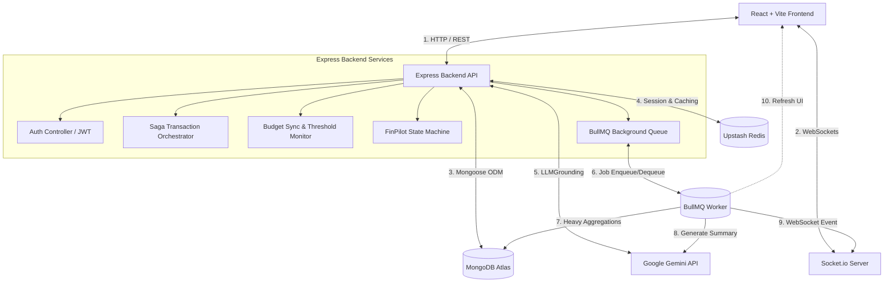

# Expense Tracker Pro — Ultimate Personal Finance Platform

Expense Tracker Pro is a real-time, AI-driven personal finance platform that combines conversational transaction logging, threshold-based budgeting, peer-to-peer bill splitting, and an integrated digital wallet.

Built with a modern full-stack architecture using **React, Vite, Tailwind CSS, Express, MongoDB Atlas, and Upstash Redis**, it delivers sub-5ms search speeds, robust transactional integrity, and intelligent financial summaries.

---

## 🚀 Key Technical Highlights

1. **FinPilot AI Assistant**: Natural language transaction logging grounded in live financial data, driven by an Upstash Redis-backed state machine with built-in entity disambiguation and interactive confirmation cards.
2. **Orchestration Sagas**: Ensures atomic database writes across multi-collection financial mutations. If any step fails, the orchestrator rolls back the database.
3. **Proactive Real-Time Budgets**: Monitors category transactions and broadcasts alerts via WebSockets when users reach 80%, 90%, or 100% of their monthly limit.
4. **Two-Tier Search Caching**: Combines L1 (in-memory LRU) and L2 (Upstash Redis) caching for instant transactions autocompletion with smart cache invalidations on mutations.
5. **Asynchronous AI Insights Pipeline**: Uses BullMQ background queue processing to compute complex z-score spend alerts and Gemini-powered monthly insights without blocking the main Express request thread.

---

## 🛠️ System Architecture & Data Flow



---

## 🌟 Recent Enhancements & Bug Fixes

We have recently refactored the codebase to address rendering inefficiencies, autofill issues, database cache serialization, and visual aesthetics:

### 1. Autofill & Login/Signup Enhancements
* **Autofill Disabling**: Reconfigured sensitive input forms (Login, Register, Profile) with `autoComplete="new-email"`, `autoComplete="new-password"`, and `autoComplete="off"` to prevent browsers from automatically pre-populating forms with cached credentials.
* **Email Restriction**: Enforced a strict validation rule allowing only `@gmail.com` accounts across register, login, and profile update endpoints, complete with immediate client-side error states and backend validation middleware.
* **Premium Auth UI**: Styled auth views with glassmorphic cards featuring high-blur backdrops, glowing borders, and an interactive dark space-themed glowing finance background.

### 2. Multi-Refresh & Socket Disconnect Fixes
* **Debounced listeners**: Coalesced rapid-fire updates (such as concurrent WebSockets and self-triggering updates) by debouncing the `financialDataUpdated` event listener with a 500ms window across all pages and contexts.
* **Stable Dependencies**: Replaced unstable object dependencies (like the `user` object) with reference-stable strings (like `user?._id`) in all react `useEffect` and `useCallback` dependency arrays.
* **Redundant Sockets Prevented**: Anchored Socket.io client connections and chatbot session initializers to the stable `userId`, eliminating loop reconnections.

### 3. Anti-Flicker Skeleton Loaders
* **Silent Update Mode**: Introduced a `silent` background refresh parameter to key page fetching hooks (Dashboard, Analytics, Transactions, Budgets, Wallet). This allows background data synchronization (e.g. following socket broadcasts) to fetch data without triggering full-screen loading spinners, preventing flashing interfaces.

### 4. Analytics Chart Cache Serialization Fix
* **Array Caching Wrapper**: Fixed a bug where spreading the trend array directly inside the Upstash Redis caching helper turned the array into a keyed index object (`{ '0': ..., '1': ... }`), causing the frontend line charts to fail to render. Wrapped the trend data inside an `{ items: trend }` object before cache storage to preserve serializability.

### 5. Async Budget Form Categories Selector Fix
* Added `categories` to the dependencies array of the `BudgetForm` react component, ensuring that once the categories list resolves asynchronously, the default selection matches the first element rather than remaining blank.

### 6. Faster Post-Login Transitions
* Switched the core client views (`Login`, `Register`, `Dashboard`) from lazy loading to eager static imports to bypass chunk-fetching delays and load the landing screen immediately after login.

### 7. Failed Payment Tracking & Audit
* Introduced a backend `POST /payment/fail` API endpoint and integrated it on the frontend. When a top-up or subscription upgrade fails or is cancelled/dismissed by the user during the Razorpay checkout, the frontend automatically reports the failure. The server marks the payment record as `"failed"` and inserts a failed entry in the `WalletTransaction` collection with `status: "failed"` to ensure a complete audit history.

---

## 📂 Project Directory Structure

```
Expense-Tracker/
├── backend/
│   ├── config/              # Database & Redis clients
│   ├── controllers/         # REST API Handlers & AI chatbot routes
│   ├── middleware/          # JWT auth, compression, and schema validators
│   ├── models/              # Mongoose DB schema definitions
│   ├── routes/              # Express API endpoint declarations
│   ├── services/            # Saga orchestrator, budget monitor, email simulator
│   └── server.js            # Main server entry & socket configuration
├── frontend/
│   ├── public/              # Global static files (including backgrounds)
│   ├── src/
│   │   ├── components/      # Reusable widgets, forms, sidebar, navbar
│   │   ├── context/         # Auth, Socket, Chat, and Theme react contexts
│   │   ├── pages/           # Pages (Dashboard, Wallet, Splits, Budgets, Analytics)
│   │   └── App.jsx          # Route handlers & main wrapper
│   └── vite.config.js       # Vite bundler configurations
└── docker-compose.yml       # Dev setup docker runner
```

---

## ⚙️ Setup and Installation

### Prerequisites
* **Node.js**: v18 or later
* **MongoDB**: A running Atlas or local MongoDB instance
* **Redis**: An Upstash Redis REST token/URL or a local Redis instance
* **Gemini API Key**: A valid Google Gemini AI developer API token

### 1. Backend Setup
1. Navigate to the backend directory:
   ```bash
   cd backend
   ```
2. Install dependencies:
   ```bash
   npm install
   ```
3. Configure the environment variable file `.env` based on `.env.example`:
   ```env
   PORT=5000
   MONGO_URI=your_mongodb_connection_string
   JWT_SECRET=your_jwt_signature_secret
   GEMINI_API_KEY=your_gemini_api_key
   REDIS_URL=your_upstash_redis_rest_url
   REDIS_TOKEN=your_upstash_redis_rest_token
   BULL_REDIS_URL=your_bullmq_ioredis_url
   ```
4. Start the backend developer server:
   ```bash
   npm run dev
   ```

### 2. Frontend Setup
1. Navigate to the frontend directory:
   ```bash
   cd ../frontend
   ```
2. Install dependencies:
   ```bash
   npm install
   ```
3. Create/update the `.env` file:
   ```env
   VITE_API_URL=http://localhost:5000
   ```
4. Start the client:
   ```bash
   npm run dev
   ```

---

## 🧪 Verification & Testing

### Automated Tests
Run the comprehensive backend integration test suite:
```bash
cd backend
npm test
```
The test suite validates authentication rules (including Gmail lockouts), transaction sagas, and budget checks.

### Production Build
Verify the Vite client compiles cleanly without dynamic bundler warnings or chunk errors:
```bash
cd frontend
npm run build
```
