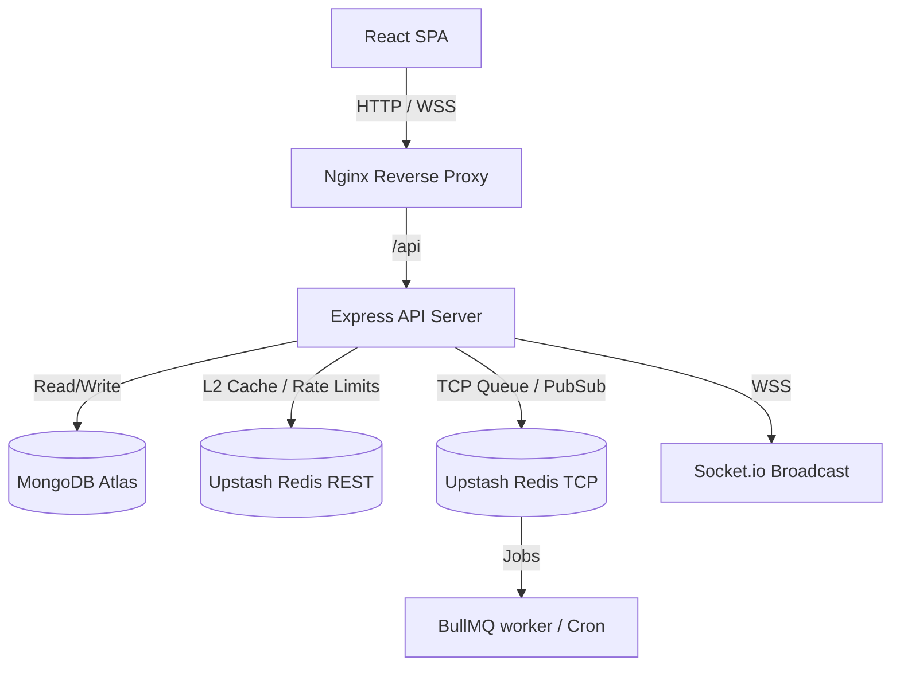

# System Architecture

Expense Tracker Pro is designed as a modern, horizontally-scalable MERN application with a dual-cache L1/L2 strategy and asynchronous event-driven queues.

## Technology Stack

1. **Frontend (React)**: Served via Nginx (Dockerized) or Vercel. Communicates with the API using Axios and connects via WebSocket using Socket.io-client.
2. **Backend (Express)**: Handles REST API requests, token/cookie-based sessions, and serves as the API gateway.
3. **Database (MongoDB)**: Scalable document store for user profiles, budgets, splits, notifications, and transaction history. Hardened with field-level indexes.
4. **Distributed Cache (Upstash Redis REST)**:
   - Persists express-rate-limit counters globally.
   - Powers L2 API caching using **Cache Versioning** to eliminate O(N) `keys()` scans.
5. **Distributed Broker (Upstash Redis TCP)**:
   - Manages asynchronous queues for BullMQ workers.
   - Powers Socket.io multi-instance broadcasting adapter.

## Performance Caching (Cache Versioning)

To avoid performance degradation caused by Redis `keys()` scans (which block single-threaded Redis engines), we use a distributed versioning strategy:
- Each user is assigned a version counter for specific cached datasets in Redis (e.g. `notif-version:userId`, `search-version:userId`, `budget-version:userId`).
- Every cache write prefixes keys with this version (e.g., `search:userId:v12:pizza`).
- Invalidation is an O(1) atomic write: we simply increment the user's version counter (e.g., `INCR search-version:userId`).
- Stale keys naturally expire via TTL without requiring scans or manual deletions.
