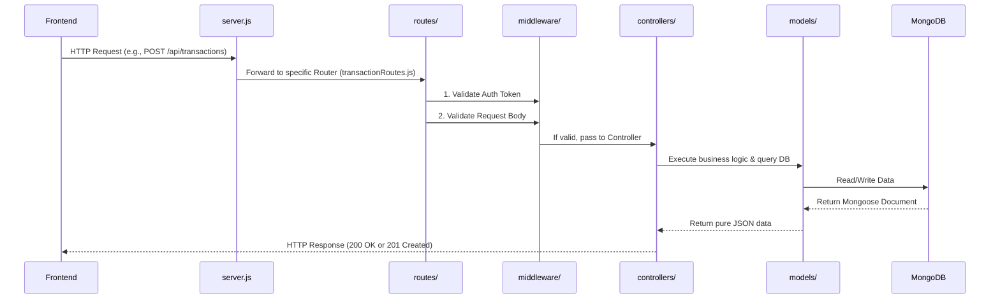

# Expense Tracker Backend Architecture Guide

This document breaks down exactly how the Expense Tracker backend is structured, how the data flows from a user request to the database, and the purpose of every layer in the system.

> [!TIP]
> The backend follows the standard **MVC (Model-View-Controller)** pattern adapted for an API. Since there is no "View" (the frontend React app handles that), it's effectively a **Model-Routes-Controller** architecture.

## 1. High-Level Data Flow

When a user interacts with the app (e.g., clicking "Add Transaction"), here is the exact path the request takes through the Node.js application:



---

## 2. File-by-File Breakdown

### Phase 1: The Entry Point (`server.js` & `config/`)
`server.js` is the heart of the application. When you run `npm run dev`, this is the file that executes.
 
1. **Imports & Setup**: It requires `express` to run the HTTP server, `dotenv` to load environment variables (like your `MONGO_URI`), and security packages like `cors` and `helmet`.
2. **Environment Validation (`config/envValidation.js`)**: Before doing anything, it runs a script to ensure crucial environment variables (`MONGO_URI` and `JWT_SECRET`) exist. If they don't, it crashes intentionally to protect the app.
3. **Database Connection (`config/db.js`)**: Invokes `mongoose.connect()` to connect Node to your Atlas MongoDB.
4. **Middleware Attachment**: It attaches `app.use(express.json())` so your server can understand JSON bodies, and `app.use(helmet())` for HTTP header security.
5. **Route Delegation**: It delegates chunks of URLs to specific routing files:
   ```javascript
   app.use("/api/transactions", require("./routes/transactionRoutes"));
   ```
6. **Error Handling & Listening**: It binds a global custom error handler (`middleware/errorMiddleware.js`) to format crashes into pretty JSON, then runs `app.listen(5000)`.

### Phase 2: The Routes Layer (`routes/`)
Routes are the "Traffic Cops". They don't do any complex math or database writing; they just look at a request and send it to the right Controller.

> [!NOTE]
> Let's look at `routes/transactionRoutes.js` as an example:
> `router.post("/", protect, validateTransaction, addTransaction);`
> This means: "When someone sends a POST request here, first run the `protect` middleware, then run `validateTransaction` middleware, and finally give the data to the `addTransaction` controller."

### Phase 3: The Middleware Layer (`middleware/`)
Middlewares are guard checks that sit between the Route and the Controller.

- **`authMiddleware.js` (The `protect` function)**: This is crucial. It looks at the incoming request's Headers for an `Authorization` token. It extracts the `Bearer <token>` string, uses `jsonwebtoken` to verify it against your `JWT_SECRET`, and extracts the decoded User ID. It then fetches that User from the DB and attaches it to `req.user`. If the token is fake or expired, it rejects the request with a `401 Unauthorized` before it ever reaches the controller!
- **`validationMiddleware.js` & `transactionValidation.js`**: Uses `express-validator` to ensure users don't break the database. For example, it checks that the `amount` field in a transaction is a `Numeric` value greater than 0 before continuing.

### Phase 4: The Controller Layer (`controllers/`)
Controllers contain the actual **Business Logic**. Once a request passes all middlewares, it arrives here.

> [!IMPORTANT]
> The Controller's job is: Combine user inputs (`req.body`) with user identity (`req.user`), interact with the Database, and shoot a response back to the client.

- **`authController.js`**: Checks if an email doesn't already exist, hashes the password using `bcryptjs` (so raw passwords are never saved), creates the User document in MongoDB, generates a new JWT using `utils/generateToken.js`, and sends everything back.
- **`transactionController.js`**: Puts together the user's `req.user._id`, the `amount`, `category`, etc., and runs `Transaction.create()`. It also handles logic to make sure users can only delete *their own* transactions.
- **`analyticsController.js`**: This is where heavy math happens. Instead of basic `find()` operations, it uses **MongoDB Aggregation Pipelines**. It groups transactions by `$type` (income/expense) or groups expenses by `$category` and sums up the `$amount`. This allows the database to do the heavy calculation instead of NodeJS.

### Phase 5: The Model Layer (`models/`)
Models dictate the structure (the schema) of how data is physically saved in the MongoDB NoSQL database.

- **`user.js`**: Defines standard fields (`name`, `email`, `password`).
- **`category.js`**: A simple map containing the category name and the User ID that created it.
- **`Transaction.js`**: Contains `amount`, an `enum` determining if it's "income" or "expense", the date, and relationships via `mongoose.Schema.Types.ObjectId`. By linking `ref: "Category"`, Mongoose knows exactly how to dynamically swap category IDs with full Category Objects when you call `.populate("category")` in the controllers!
